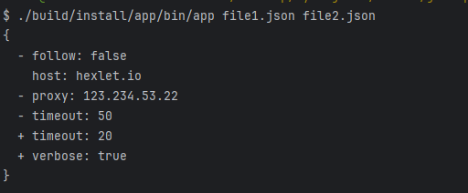
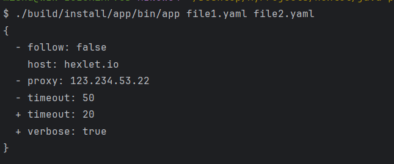

### Hexlet tests and linter status:
[](https://github.com/Jora777F/java-project-71/actions)
[](https://sonarcloud.io/summary/new_code?id=Jora777F_java-project-71)
[](https://sonarcloud.io/summary/new_code?id=Jora777F_java-project-71)
[](https://sonarcloud.io/summary/new_code?id=Jora777F_java-project-71)

### 📖 Описание проекта
Программа сравнивает два документа `JSON` (или `YAML`) и выводит отчет в одном из выбранных форматов.

### 🚀 Запуск проекта
Программа запускается при помощи командной строки, которая использует возможности Picocli.  
Команда, которая представлена ниже, отображает справочную информацию.
```java
./build/install/app/bin/app -h
```
Опираясь на справку, можно заметить, что программа позволяет _указать два файла и формат вывода_ (по умолчанию используется **stylish**). Пример показан ниже.
```java
./build/install/app/bin/app -f plain file1.json file2.json
```

### 🎦 Демонстрация работы приложения
Сравнение **JSON**-файлов:



Сравнение **YAML**-файлов:


